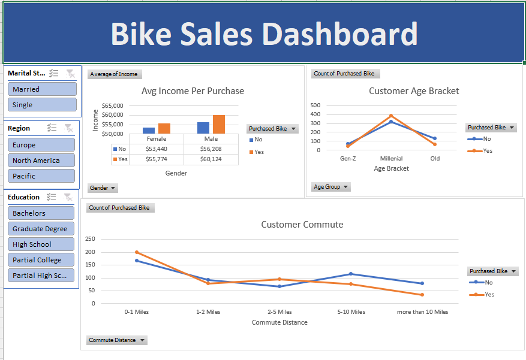

## 📊 Bike Sales Analysis (Excel)

### 📌 Objective

The objective of this project is to analyze customer demographic and behavioral data to identify key factors influencing bike purchases and uncover actionable insights.

---

### 📂 Dataset

The dataset contains customer-level information, including:

* Age
* Income
* Gender
* Marital Status
* Education
* Region
* Commute Distance
* Bike Purchase Status (Yes/No)

---

### 🛠 Tools Used

* Microsoft Excel

  * Data Cleaning
  * Pivot Tables
  * Charts
  * Slicers (Filters)

---

### 🔄 Process

* Cleaned and prepared raw data for analysis
* Created pivot tables to explore relationships between customer attributes and bike purchases
* Built an interactive dashboard to visualize trends and patterns

---

### 📈 Key Analysis

* Comparison of income levels between customers who purchased bikes and those who did not
* Distribution of bike purchases across different age groups
* Impact of commute distance on purchase behavior
* Segmentation by region, education, and marital status using filters

---

### 💡 Key Insights

* Customers with higher average income are more likely to purchase bikes
* Middle-aged customers represent the largest segment of bike buyers
* Customers with shorter commute distances show a higher likelihood of purchasing bikes
* Demographic factors such as region and education influence purchasing patterns

---

### 📷 Dashboard  
The interactive dashboard provides a visual overview of bike sales data, allowing users to explore trends based on customer demographics such as age, income, commute distance, and region. Filters (slicers) enable dynamic analysis of different customer segments.

### ✅ Conclusion

This analysis highlights how demographic and lifestyle factors influence bike purchasing behavior. The dashboard provides an interactive way to explore these patterns and can support data-driven decision-making.

---

